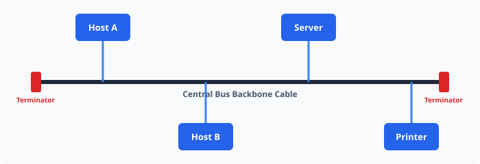

# UNIT 1: COMPUTER NETWORKS & DATA COMMUNICATIONS

## 2021 (NOV-DEC) EXAMINATION REVISION NOTES

### Question 1: Explain the OSI Reference Model and compare it with the TCP/IP Model.

The Open Systems Interconnection (OSI) model is a conceptual framework used to understand network interactions. It divides network communication into seven distinct layers, each with specific protocol responsibilities.

#### Key OSI Layers:
1. **Application Layer**: Provides network services directly to end-user applications (HTTP, FTP, SMTP).
2. **Presentation Layer**: Handles data formatting, encryption, and compression (SSL/TLS, JPEG).
3. **Session Layer**: Manages sessions between applications (RPC, NetBIOS).
4. **Transport Layer**: End-to-end communication, flow control, and error control (TCP, UDP).
5. **Network Layer**: Path determination and logical addressing (IP, ICMP, OSPF).
6. **Data Link Layer**: Physical addressing and framing (Ethernet, MAC, PPP).
7. **Physical Layer**: Bit-level transmission over physical media (Cables, Fiber, Radio).

#### Comparison Table: OSI vs. TCP/IP Model

| Parameter | OSI Model | TCP/IP Model |
|---|---|---|
| Full Name | Open Systems Interconnection | Transmission Control Protocol / Internet Protocol |
| Number of Layers | 7 Layers | 4 Layers |
| Approach | Theoretical / Conceptual | Practical / Protocol Oriented |
| Session & Presentation | Separate explicit layers | Combined into Application layer |
| Implementation | Standard development framework | Dominant global internet protocol |

---

### Question 2: Describe Bus Topology and Mesh Topology with Network Diagrams.

Network topology defines the physical or logical arrangement of nodes, devices, and links in a computer network.

#### 1. Bus Topology
In a bus topology, all network devices are connected to a single central cable called the **backbone** or bus.

- **Advantages**:
  - Easy to connect a computer or peripheral to a linear bus.
  - Requires less cable length than a star topology.
- **Disadvantages**:
  - Entire network shuts down if there is a break in the main cable.
  - Terminators are required at both ends of the backbone cable.

#### 2. Mesh Topology
In a mesh topology, every device has a dedicated point-to-point link to every other device on the network.

- **Formula for physical channels**: For $N$ devices, the number of physical links is:
  $$\text{Links} = \frac{N(N - 1)}{2}$$

---

### Question 3: Write a short note on Packet Switching vs. Circuit Switching.

Packet switching and circuit switching represent the two fundamental paradigms for routing data across telecommunication networks.

1. **Circuit Switching**:
   - Dedicated communication path established before data transfer begins.
   - Guaranteed bandwidth and constant data rates (e.g., traditional PSTN telephone networks).
   - Inefficient link utilization during silence periods.

2. **Packet Switching**:
   - Data is broken down into small packets containing header metadata and payload data.
   - Dynamic routing through intermediate routers.
   - High bandwidth efficiency via statistical multiplexing.
